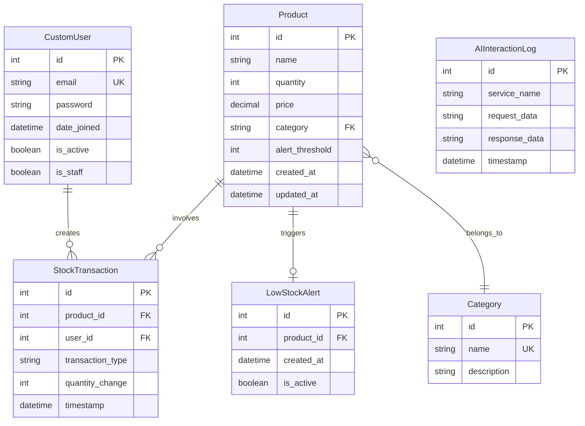

# Design Document: Inventory Management System

## Overview

The Inventory Management System is a Django-based web application that provides comprehensive inventory tracking, transaction management, and reporting capabilities for small businesses. The system follows a monolithic architecture with Django handling both backend API logic and frontend template rendering, using SQLite as the database backend.

### Key Design Principles

- **Simplicity**: Leverage Django's built-in features (ORM, admin, authentication) to minimize custom code
- **Security**: Implement Django's security best practices including CSRF protection, SQL injection prevention, and secure password hashing
- **Responsiveness**: Mobile-first design using Bootstrap 5 for responsive layouts
- **Real-time Updates**: HTMX for dynamic UI updates without full page reloads
- **Extensibility**: RESTful API endpoints to support future AI integration and third-party services

### Technology Stack

- **Backend Framework**: Django 4.2+ (Python 3.10+)
- **Database**: SQLite 3 (with migration path to PostgreSQL for production scaling)
- **Frontend**: Django Templates + Bootstrap 5 + HTMX
- **Authentication**: Django's built-in authentication system with email as username
- **API**: Django REST Framework for AI integration endpoints
- **Reporting**: ReportLab (PDF generation) + Python CSV module
- **Testing**: pytest + pytest-django + Hypothesis (property-based testing)

## Architecture

### System Architecture

The system follows Django's MVT (Model-View-Template) pattern with additional API layer for external integrations:

```
┌─────────────────────────────────────────────────────────────┐
│                        Client Layer                          │
│  (Web Browser - Desktop/Mobile)                             │
└─────────────────────────────────────────────────────────────┘
                            │
                            │ HTTPS
                            ▼
┌─────────────────────────────────────────────────────────────┐
│                     Django Application                       │
│                                                              │
│  ┌──────────────┐  ┌──────────────┐  ┌──────────────┐     │
│  │   Views      │  │   Templates  │  │   REST API   │     │
│  │  (Business   │◄─┤   (HTML +    │  │  (External   │     │
│  │   Logic)     │  │   HTMX)      │  │   Services)  │     │
│  └──────┬───────┘  └──────────────┘  └──────┬───────┘     │
│         │                                     │              │
│         └─────────────┬───────────────────────┘              │
│                       ▼                                      │
│              ┌─────────────────┐                            │
│              │   Models (ORM)  │                            │
│              └────────┬────────┘                            │
│                       │                                      │
│              ┌────────▼────────┐                            │
│              │  Middleware     │                            │
│              │  - Auth         │                            │
│              │  - CSRF         │                            │
│              │  - Security     │                            │
│              └────────┬────────┘                            │
└───────────────────────┼─────────────────────────────────────┘
                        │
                        ▼
              ┌──────────────────┐
              │  SQLite Database │
              └──────────────────┘
```

### Application Structure

```
inventory_system/
├── manage.py
├── config/                      # Project configuration
│   ├── settings.py
│   ├── urls.py
│   └── wsgi.py
├── inventory/                   # Main application
│   ├── models.py               # Data models
│   ├── views.py                # View logic
│   ├── forms.py                # Form definitions
│   ├── serializers.py          # API serializers
│   ├── urls.py                 # URL routing
│   ├── services.py             # Business logic layer
│   ├── validators.py           # Custom validators
│   └── templates/
│       └── inventory/
│           ├── base.html
│           ├── dashboard.html
│           ├── product_list.html
│           ├── product_form.html
│           ├── transaction_history.html
│           └── reports.html
├── accounts/                    # Authentication app
│   ├── models.py
│   ├── views.py
│   ├── forms.py
│   └── templates/
│       └── accounts/
│           ├── login.html
│           └── register.html
├── api/                        # REST API for AI integration
│   ├── views.py
│   ├── serializers.py
│   └── urls.py
├── static/
│   ├── css/
│   ├── js/
│   └── img/
└── tests/
    ├── unit/
    ├── integration/
    └── properties/
```

## Components and Interfaces

### 1. Authentication Component

**Purpose**: Manage user authentication using email-based login

**Key Classes**:
- `CustomUser` (extends Django's AbstractUser)
- `EmailAuthenticationBackend`
- `LoginView`, `LogoutView`, `RegisterView`

**Interfaces**:
```python
class CustomUser(AbstractUser):
    """User model with email as primary identifier"""
    email = models.EmailField(unique=True)
    username = None  # Remove username field
    
    USERNAME_FIELD = 'email'
    REQUIRED_FIELDS = []

class EmailAuthenticationBackend(ModelBackend):
    """Authenticate using email instead of username"""
    def authenticate(self, request, username=None, password=None, **kwargs):
        # Authenticate with email
        pass
```

### 2. Product Management Component

**Purpose**: Handle CRUD operations for inventory products

**Key Classes**:
- `Product` (model)
- `ProductService` (business logic)
- `ProductForm`
- `ProductListView`, `ProductCreateView`, `ProductUpdateView`, `ProductDeleteView`

**Interfaces**:
```python
class ProductService:
    """Business logic for product operations"""
    
    def create_product(self, name: str, quantity: int, price: Decimal, 
                      category: str, alert_threshold: int) -> Product:
        """Create and validate new product"""
        pass
    
    def update_product(self, product_id: int, **kwargs) -> Product:
        """Update product with validation"""
        pass
    
    def bulk_update_quantities(self, updates: List[Dict]) -> List[Product]:
        """Update multiple products atomically"""
        pass
    
    def bulk_update_prices(self, updates: List[Dict]) -> List[Product]:
        """Update multiple product prices atomically"""
        pass
    
    def search_products(self, query: str, category: str = None, 
                       stock_status: str = None) -> QuerySet:
        """Search and filter products"""
        pass
```

### 3. Transaction Processing Component

**Purpose**: Record and process inventory transactions (purchases/sales)

**Key Classes**:
- `StockTransaction` (model)
- `TransactionService` (business logic)
- `TransactionForm`
- `TransactionCreateView`, `TransactionHistoryView`

**Interfaces**:
```python
class TransactionService:
    """Business logic for transaction processing"""
    
    def record_purchase(self, product_id: int, quantity: int, 
                       user_id: int) -> StockTransaction:
        """Record purchase and increase stock"""
        pass
    
    def record_sale(self, product_id: int, quantity: int, 
                   user_id: int) -> StockTransaction:
        """Record sale and decrease stock, validate sufficient inventory"""
        pass
    
    def get_transaction_history(self, product_id: int = None, 
                               start_date: date = None, 
                               end_date: date = None,
                               transaction_type: str = None) -> QuerySet:
        """Retrieve filtered transaction history"""
        pass
```

### 4. Alert Management Component

**Purpose**: Monitor stock levels and generate low-stock alerts

**Key Classes**:
- `LowStockAlert` (model)
- `AlertService` (business logic)

**Interfaces**:
```python
class AlertService:
    """Business logic for alert management"""
    
    def check_and_create_alert(self, product: Product) -> Optional[LowStockAlert]:
        """Check if product is below threshold and create alert"""
        pass
    
    def resolve_alert(self, product: Product) -> None:
        """Remove alert when stock rises above threshold"""
        pass
    
    def get_active_alerts(self) -> QuerySet:
        """Retrieve all active low-stock alerts"""
        pass
```

### 5. Dashboard Component

**Purpose**: Display real-time inventory metrics and status

**Key Classes**:
- `DashboardView`
- `DashboardService`

**Interfaces**:
```python
class DashboardService:
    """Business logic for dashboard data aggregation"""
    
    def get_dashboard_metrics(self) -> Dict:
        """
        Returns:
        {
            'total_products': int,
            'total_inventory_value': Decimal,
            'low_stock_count': int,
            'low_stock_products': QuerySet,
            'recent_transactions': QuerySet
        }
        """
        pass
```

### 6. Reporting Component

**Purpose**: Generate and export inventory reports

**Key Classes**:
- `ReportService`
- `ReportExportView`

**Interfaces**:
```python
class ReportService:
    """Business logic for report generation"""
    
    def generate_inventory_report(self, category: str = None) -> List[Dict]:
        """Generate inventory report data"""
        pass
    
    def export_to_csv(self, report_data: List[Dict]) -> HttpResponse:
        """Export report as CSV file"""
        pass
    
    def export_to_pdf(self, report_data: List[Dict]) -> HttpResponse:
        """Export report as PDF file"""
        pass
```

### 7. API Component (AI Integration)

**Purpose**: Provide REST API endpoints for external AI services

**Key Classes**:
- `ProductAPIViewSet`
- `TransactionAPIViewSet`
- `RecommendationAPIView`

**Interfaces**:
```python
class ProductAPIViewSet(viewsets.ReadOnlyModelViewSet):
    """Read-only API for product data"""
    # GET /api/products/
    # GET /api/products/{id}/
    pass

class TransactionAPIViewSet(viewsets.ReadOnlyModelViewSet):
    """Read-only API for transaction history"""
    # GET /api/transactions/
    # GET /api/transactions/{id}/
    pass

class RecommendationAPIView(APIView):
    """Accept AI-generated recommendations"""
    # POST /api/recommendations/
    def post(self, request):
        """Process AI recommendation and log interaction"""
        pass
```

## Data Models

### Entity Relationship Diagram



### Model Definitions

```python
from django.db import models
from django.contrib.auth.models import AbstractUser
from django.core.validators import MinValueValidator
from decimal import Decimal

class CustomUser(AbstractUser):
    """User model with email authentication"""
    email = models.EmailField(unique=True, db_index=True)
    username = None
    
    USERNAME_FIELD = 'email'
    REQUIRED_FIELDS = []
    
    class Meta:
        db_table = 'users'
        indexes = [
            models.Index(fields=['email']),
        ]

class Category(models.Model):
    """Product category"""
    name = models.CharField(max_length=100, unique=True, db_index=True)
    description = models.TextField(blank=True)
    
    class Meta:
        db_table = 'categories'
        verbose_name_plural = 'categories'

class Product(models.Model):
    """Inventory product"""
    name = models.CharField(max_length=200, db_index=True)
    quantity = models.IntegerField(
        validators=[MinValueValidator(0)],
        help_text="Current stock quantity"
    )
    price = models.DecimalField(
        max_digits=10,
        decimal_places=2,
        validators=[MinValueValidator(Decimal('0.01'))]
    )
    category = models.ForeignKey(
        Category,
        on_delete=models.PROTECT,
        related_name='products'
    )
    alert_threshold = models.IntegerField(
        validators=[MinValueValidator(0)],
        help_text="Minimum quantity before alert"
    )
    created_at = models.DateTimeField(auto_now_add=True)
    updated_at = models.DateTimeField(auto_now=True)
    
    class Meta:
        db_table = 'products'
        indexes = [
            models.Index(fields=['name']),
            models.Index(fields=['category']),
            models.Index(fields=['quantity']),
        ]
    
    @property
    def total_value(self) -> Decimal:
        """Calculate total value of product stock"""
        return self.quantity * self.price
    
    @property
    def is_low_stock(self) -> bool:
        """Check if product is below alert threshold"""
        return self.quantity < self.alert_threshold
    
    @property
    def stock_status(self) -> str:
        """Return stock status: in-stock, low-stock, out-of-stock"""
        if self.quantity == 0:
            return 'out-of-stock'
        elif self.is_low_stock:
            return 'low-stock'
        return 'in-stock'

class StockTransaction(models.Model):
    """Record of inventory changes"""
    TRANSACTION_TYPES = [
        ('purchase', 'Purchase'),
        ('sale', 'Sale'),
    ]
    
    product = models.ForeignKey(
        Product,
        on_delete=models.CASCADE,
        related_name='transactions'
    )
    user = models.ForeignKey(
        CustomUser,
        on_delete=models.SET_NULL,
        null=True,
        related_name='transactions'
    )
    transaction_type = models.CharField(
        max_length=10,
        choices=TRANSACTION_TYPES,
        db_index=True
    )
    quantity_change = models.IntegerField()
    timestamp = models.DateTimeField(auto_now_add=True, db_index=True)
    
    class Meta:
        db_table = 'stock_transactions'
        ordering = ['-timestamp']
        indexes = [
            models.Index(fields=['-timestamp']),
            models.Index(fields=['product', '-timestamp']),
            models.Index(fields=['transaction_type']),
        ]

class LowStockAlert(models.Model):
    """Alert for products below threshold"""
    product = models.OneToOneField(
        Product,
        on_delete=models.CASCADE,
        related_name='alert'
    )
    created_at = models.DateTimeField(auto_now_add=True)
    is_active = models.BooleanField(default=True, db_index=True)
    
    class Meta:
        db_table = 'low_stock_alerts'
        indexes = [
            models.Index(fields=['is_active', 'created_at']),
        ]

class AIInteractionLog(models.Model):
    """Log of AI service interactions"""
    service_name = models.CharField(max_length=100)
    request_data = models.JSONField()
    response_data = models.JSONField()
    timestamp = models.DateTimeField(auto_now_add=True, db_index=True)
    
    class Meta:
        db_table = 'ai_interaction_logs'
        ordering = ['-timestamp']
```

### Database Indexing Strategy

To meet performance requirements (Requirement 12), the following indexes are implemented:

1. **Primary Keys**: Automatic B-tree indexes on all `id` fields
2. **Foreign Keys**: Automatic indexes on all foreign key columns
3. **Email**: Unique index on `CustomUser.email` for authentication lookups
4. **Product Search**: Composite index on `Product.name` and `Product.category`
5. **Transaction History**: Composite index on `StockTransaction.product_id` and `timestamp` for efficient filtering
6. **Alert Queries**: Index on `LowStockAlert.is_active` for dashboard queries


## Correctness Properties

*A property is a characteristic or behavior that should hold true across all valid executions of a system—essentially, a formal statement about what the system should do. Properties serve as the bridge between human-readable specifications and machine-verifiable correctness guarantees.*

### Property 1: Authentication Correctness

*For any* email and password combination, the authentication system should grant access if and only if the credentials match a valid user account with correct password.

**Validates: Requirements 1.1, 1.2**

### Property 2: Email Uniqueness

*For any* two user accounts, they must have different email addresses (no duplicate emails allowed).

**Validates: Requirements 1.3**

### Property 3: Password Encryption

*For any* user account, the stored password value in the database should never equal the plaintext password (must be hashed).

**Validates: Requirements 1.5**

### Property 4: Product Creation Persistence

*For any* valid product data (name, non-negative quantity, positive price, category, non-negative threshold), creating a product should result in that product being retrievable from the database with all attributes intact.

**Validates: Requirements 2.1, 2.5**

### Property 5: Product Update Persistence

*For any* existing product and valid update data, updating the product should result in the new values being stored and retrievable.

**Validates: Requirements 2.2**

### Property 6: Quantity Non-Negativity Validation

*For any* negative integer quantity value, attempting to create or update a product with that quantity should be rejected by validation.

**Validates: Requirements 2.3**

### Property 7: Price Positivity Validation

*For any* non-positive price value (zero or negative), attempting to create or update a product with that price should be rejected by validation.

**Validates: Requirements 2.4**

### Property 8: Product Deletion

*For any* existing product, deleting it should result in that product no longer being retrievable from the database.

**Validates: Requirements 2.6**

### Property 9: Purchase Increases Quantity

*For any* product and positive purchase quantity, recording a purchase transaction should increase the product's quantity by exactly the purchase amount.

**Validates: Requirements 3.1**

### Property 10: Sale Decreases Quantity

*For any* product with sufficient stock and positive sale quantity, recording a sale transaction should decrease the product's quantity by exactly the sale amount.

**Validates: Requirements 3.2**

### Property 11: Overselling Prevention

*For any* product and sale quantity that exceeds the product's current quantity, attempting to record the sale should be rejected and the product quantity should remain unchanged.

**Validates: Requirements 3.3**

### Property 12: Transaction Logging Completeness

*For any* completed stock transaction (purchase or sale), a transaction record should be created in the transaction history containing timestamp, product reference, transaction type, quantity change, and user identifier.

**Validates: Requirements 3.4, 3.5, 8.1**

### Property 13: Alert Generation on Low Stock

*For any* product, when its quantity falls below its alert threshold, an active low-stock alert should exist for that product.

**Validates: Requirements 4.1**

### Property 14: Alert Resolution on Stock Increase

*For any* product with an active low-stock alert, when its quantity rises to or above its alert threshold, the alert should be removed or marked inactive.

**Validates: Requirements 4.4**

### Property 15: Alert Threshold Configuration

*For any* product and non-negative threshold value, setting the alert threshold should result in that threshold being stored and used for alert generation.

**Validates: Requirements 4.3**

### Property 16: Alert Threshold Validation

*For any* negative threshold value, attempting to set it as an alert threshold should be rejected by validation.

**Validates: Requirements 4.5**

### Property 17: Product Search Matching

*For any* search query string, all returned products should have the query string appearing in their name, category, or identifier (case-insensitive).

**Validates: Requirements 5.1**

### Property 18: Category Filtering

*For any* category filter, all returned products should belong to that category, and all products in that category should be returned.

**Validates: Requirements 5.2**

### Property 19: Stock Status Filtering

*For any* stock status filter (in-stock, low-stock, out-of-stock), all returned products should match that status based on their quantity and alert threshold.

**Validates: Requirements 5.3**

### Property 20: Bulk Update Atomicity

*For any* set of product updates where at least one fails validation, no products should be modified (all-or-nothing behavior).

**Validates: Requirements 6.3, 6.4**

### Property 21: Bulk Update Application

*For any* set of valid product updates (quantities or prices), all specified products should be updated with their new values.

**Validates: Requirements 6.1, 6.2**

### Property 22: Bulk Update Transaction Logging

*For any* successful bulk update operation affecting N products, exactly N transaction records should be created in the transaction history.

**Validates: Requirements 6.5**

### Property 23: Dashboard Metrics Accuracy

*For any* inventory state, the dashboard should display metrics (total products, total inventory value, low-stock alert count) that accurately reflect the current database state.

**Validates: Requirements 7.1, 7.3, 7.4**

### Property 24: Dashboard Alert Display

*For any* active low-stock alert, that alert should appear in the dashboard's alert list.

**Validates: Requirements 4.2**

### Property 25: Transaction History Ordering

*For any* transaction history query, results should be ordered by timestamp in descending order (most recent first).

**Validates: Requirements 8.2**

### Property 26: Transaction History Filtering

*For any* combination of filters (date range, product, transaction type), all returned transactions should match all specified filter criteria, and all matching transactions should be returned.

**Validates: Requirements 8.3, 8.4, 8.5**

### Property 27: Transaction Record Completeness

*For any* transaction in the history, it should contain all required fields: timestamp, product name, transaction type, quantity change, and admin identifier.

**Validates: Requirements 8.6**

### Property 28: Inventory Report Completeness

*For any* inventory report, it should include all products (or all products in the specified category if filtered), each with name, category, quantity, price, and total value.

**Validates: Requirements 9.1, 9.4**

### Property 29: Report Threshold Comparison

*For any* product in an inventory report that has an alert threshold configured, the report should include a comparison between current quantity and the threshold.

**Validates: Requirements 9.5**

### Property 30: Report Category Filtering

*For any* category filter applied to a report, the report should include only products from that category, and all products from that category should be included.

**Validates: Requirements 9.6**

### Property 31: CSV Export Format Validity

*For any* inventory report exported to CSV, the resulting file should be valid CSV format parseable by standard CSV libraries.

**Validates: Requirements 9.2**

### Property 32: PDF Export Generation

*For any* inventory report exported to PDF, the resulting file should be a valid PDF containing the report data.

**Validates: Requirements 9.3**

### Property 33: Unauthenticated Access Denial

*For any* inventory management feature endpoint, accessing it without valid authentication should result in access denial (redirect to login or 401/403 error).

**Validates: Requirements 10.4**

### Property 34: Database Integrity Constraints

*For any* operation that would violate database constraints (foreign key, unique constraint, not-null), the operation should be rejected and the database should remain in a consistent state.

**Validates: Requirements 10.6**

### Property 35: API Product Data Access

*For any* product in the database, it should be retrievable via the API endpoint with all product attributes present in the response.

**Validates: Requirements 13.1**

### Property 36: API Transaction Data Access

*For any* transaction in the database, it should be retrievable via the API endpoint with all transaction attributes present in the response.

**Validates: Requirements 13.2**

### Property 37: AI Recommendation Processing

*For any* valid AI-generated recommendation submitted to the API, the system should process it and return a success response.

**Validates: Requirements 13.4**

### Property 38: AI Interaction Logging

*For any* AI service interaction (request/response), a log entry should be created containing the service name, request data, response data, and timestamp.

**Validates: Requirements 13.5**

## Error Handling

### Error Handling Strategy

The system implements a layered error handling approach:

1. **Validation Layer**: Input validation at form/serializer level
2. **Business Logic Layer**: Domain rule enforcement in service classes
3. **Database Layer**: Constraint enforcement and transaction management
4. **Presentation Layer**: User-friendly error messages and logging

### Error Categories and Handling

#### 1. Validation Errors

**Scenarios**:
- Negative quantities or prices
- Invalid email formats
- Missing required fields
- Data type mismatches

**Handling**:
```python
# Django forms provide automatic validation
class ProductForm(forms.ModelForm):
    def clean_quantity(self):
        quantity = self.cleaned_data.get('quantity')
        if quantity < 0:
            raise ValidationError("Quantity cannot be negative")
        return quantity
    
    def clean_price(self):
        price = self.cleaned_data.get('price')
        if price <= 0:
            raise ValidationError("Price must be positive")
        return price
```

**User Experience**: Display field-specific error messages inline with form fields

#### 2. Business Logic Errors

**Scenarios**:
- Insufficient inventory for sale
- Duplicate email registration
- Deleting products with active transactions

**Handling**:
```python
class TransactionService:
    def record_sale(self, product_id, quantity, user_id):
        with transaction.atomic():
            product = Product.objects.select_for_update().get(id=product_id)
            
            if product.quantity < quantity:
                raise InsufficientInventoryError(
                    f"Cannot sell {quantity} units. Only {product.quantity} available."
                )
            
            product.quantity -= quantity
            product.save()
            
            StockTransaction.objects.create(
                product=product,
                user_id=user_id,
                transaction_type='sale',
                quantity_change=-quantity
            )
            
            # Check for low stock alert
            AlertService.check_and_create_alert(product)
```

**User Experience**: Display clear error messages explaining the business rule violation

#### 3. Database Errors

**Scenarios**:
- Foreign key violations
- Unique constraint violations
- Connection failures
- Transaction deadlocks

**Handling**:
```python
from django.db import IntegrityError, OperationalError

try:
    user = CustomUser.objects.create_user(email=email, password=password)
except IntegrityError:
    # Email already exists
    raise DuplicateEmailError("An account with this email already exists")
except OperationalError as e:
    # Database connection issue
    logger.error(f"Database error: {e}")
    raise SystemError("Unable to complete operation. Please try again.")
```

**User Experience**: Generic error message for users, detailed logging for administrators

#### 4. Authentication Errors

**Scenarios**:
- Invalid credentials
- Expired sessions
- Missing authentication tokens

**Handling**:
```python
from django.contrib.auth import authenticate

def login_view(request):
    email = request.POST.get('email')
    password = request.POST.get('password')
    
    user = authenticate(request, username=email, password=password)
    
    if user is None:
        messages.error(request, "Invalid email or password")
        return render(request, 'accounts/login.html')
    
    login(request, user)
    return redirect('dashboard')
```

**User Experience**: Clear feedback without revealing whether email or password was incorrect (security)

#### 5. API Errors

**Scenarios**:
- Invalid request format
- Missing required parameters
- Rate limiting
- External service failures

**Handling**:
```python
from rest_framework.views import exception_handler
from rest_framework.response import Response

def custom_exception_handler(exc, context):
    response = exception_handler(exc, context)
    
    if response is not None:
        response.data['status_code'] = response.status_code
        
    return response

# In views
class RecommendationAPIView(APIView):
    def post(self, request):
        serializer = RecommendationSerializer(data=request.data)
        
        if not serializer.is_valid():
            return Response(
                {'error': 'Invalid request format', 'details': serializer.errors},
                status=400
            )
        
        try:
            # Process recommendation
            result = process_recommendation(serializer.validated_data)
            
            # Log interaction
            AIInteractionLog.objects.create(
                service_name=request.data.get('service_name'),
                request_data=request.data,
                response_data=result
            )
            
            return Response(result, status=200)
        except Exception as e:
            logger.error(f"AI recommendation processing failed: {e}")
            return Response(
                {'error': 'Failed to process recommendation'},
                status=500
            )
```

**User Experience**: RESTful error responses with appropriate HTTP status codes

### Error Logging

All errors are logged using Python's logging framework:

```python
import logging

logger = logging.getLogger(__name__)

# Different log levels for different scenarios
logger.debug("Debug information")
logger.info("Informational message")
logger.warning("Warning message")
logger.error("Error message")
logger.critical("Critical error")
```

**Log Configuration**:
- Development: Console output with DEBUG level
- Production: File-based logging with INFO level, separate error log file
- Include request context (user, IP, timestamp) in all logs

### Transaction Management

Django's atomic transactions ensure data consistency:

```python
from django.db import transaction

@transaction.atomic
def bulk_update_products(updates):
    """All updates succeed or all fail"""
    for update in updates:
        product = Product.objects.get(id=update['id'])
        product.quantity = update['quantity']
        product.save()
        
        # Log transaction
        StockTransaction.objects.create(...)
```

## Testing Strategy

### Overview

The testing strategy employs a dual approach combining traditional unit/integration tests with property-based testing to ensure comprehensive coverage and correctness validation.

### Testing Pyramid

```
        ┌─────────────────┐
        │   E2E Tests     │  ← Selenium/Playwright (minimal)
        │   (Browser)     │
        └─────────────────┘
       ┌───────────────────┐
       │ Integration Tests │  ← Django TestCase
       │  (API, Views)     │
       └───────────────────┘
     ┌──────────────────────┐
     │   Unit Tests         │  ← pytest
     │ (Models, Services)   │
     └──────────────────────┘
   ┌────────────────────────────┐
   │  Property-Based Tests      │  ← Hypothesis
   │  (Correctness Properties)  │
   └────────────────────────────┘
```

### Unit Testing

**Purpose**: Verify specific examples, edge cases, and error conditions

**Framework**: pytest with pytest-django

**Focus Areas**:
- Model methods and properties
- Service class business logic
- Form validation
- Utility functions
- Edge cases (empty lists, boundary values, null handling)

**Example**:
```python
import pytest
from decimal import Decimal
from inventory.models import Product
from inventory.services import TransactionService

@pytest.mark.django_db
class TestTransactionService:
    def test_record_sale_with_sufficient_inventory(self):
        """Specific example: selling 5 units when 10 available"""
        product = Product.objects.create(
            name="Test Product",
            quantity=10,
            price=Decimal("19.99"),
            category_id=1,
            alert_threshold=5
        )
        
        service = TransactionService()
        transaction = service.record_sale(product.id, 5, user_id=1)
        
        product.refresh_from_db()
        assert product.quantity == 5
        assert transaction.quantity_change == -5
        assert transaction.transaction_type == 'sale'
    
    def test_record_sale_with_insufficient_inventory_raises_error(self):
        """Edge case: attempting to oversell"""
        product = Product.objects.create(
            name="Test Product",
            quantity=3,
            price=Decimal("19.99"),
            category_id=1,
            alert_threshold=5
        )
        
        service = TransactionService()
        
        with pytest.raises(InsufficientInventoryError):
            service.record_sale(product.id, 5, user_id=1)
        
        product.refresh_from_db()
        assert product.quantity == 3  # Unchanged
```

### Property-Based Testing

**Purpose**: Verify universal properties across all inputs through randomized testing

**Framework**: Hypothesis

**Configuration**: Minimum 100 iterations per test (configured via `@settings(max_examples=100)`)

**Focus Areas**: All 38 correctness properties defined in the design document

**Property Test Structure**:
```python
from hypothesis import given, strategies as st, settings
from hypothesis.extra.django import from_model
import pytest

@pytest.mark.django_db
@settings(max_examples=100)
@given(
    quantity=st.integers(min_value=0, max_value=10000),
    purchase_amount=st.integers(min_value=1, max_value=1000)
)
def test_property_purchase_increases_quantity(quantity, purchase_amount):
    """
    Feature: inventory-management-system, Property 9: 
    For any product and positive purchase quantity, recording a purchase 
    transaction should increase the product's quantity by exactly the 
    purchase amount.
    """
    # Arrange
    product = Product.objects.create(
        name="Test Product",
        quantity=quantity,
        price=Decimal("10.00"),
        category_id=1,
        alert_threshold=5
    )
    initial_quantity = product.quantity
    
    # Act
    service = TransactionService()
    service.record_purchase(product.id, purchase_amount, user_id=1)
    
    # Assert
    product.refresh_from_db()
    assert product.quantity == initial_quantity + purchase_amount

@pytest.mark.django_db
@settings(max_examples=100)
@given(
    product_data=from_model(
        Product,
        quantity=st.integers(min_value=0, max_value=10000),
        price=st.decimals(min_value="0.01", max_value="9999.99", places=2)
    )
)
def test_property_product_creation_persistence(product_data):
    """
    Feature: inventory-management-system, Property 4:
    For any valid product data, creating a product should result in that 
    product being retrievable from the database with all attributes intact.
    """
    # Act
    product = Product.objects.create(**product_data)
    retrieved = Product.objects.get(id=product.id)
    
    # Assert
    assert retrieved.name == product_data['name']
    assert retrieved.quantity == product_data['quantity']
    assert retrieved.price == product_data['price']
    assert retrieved.category_id == product_data['category_id']
```

**Hypothesis Strategies**:
- `st.integers()`: Generate random integers with constraints
- `st.decimals()`: Generate random decimal values
- `st.text()`: Generate random strings
- `st.emails()`: Generate valid email addresses
- `from_model()`: Generate model instances with valid data
- `st.lists()`: Generate lists for bulk operations

### Integration Testing

**Purpose**: Verify component interactions and end-to-end workflows

**Framework**: Django TestCase

**Focus Areas**:
- View responses and redirects
- Form submission workflows
- API endpoint responses
- Authentication flows
- Dashboard data aggregation

**Example**:
```python
from django.test import TestCase, Client
from django.urls import reverse

class TestProductViews(TestCase):
    def setUp(self):
        self.client = Client()
        self.user = CustomUser.objects.create_user(
            email='test@example.com',
            password='testpass123'
        )
        self.client.login(email='test@example.com', password='testpass123')
    
    def test_product_create_view_creates_product_and_redirects(self):
        """Integration test: form submission creates product"""
        response = self.client.post(reverse('product-create'), {
            'name': 'New Product',
            'quantity': 100,
            'price': '29.99',
            'category': 1,
            'alert_threshold': 10
        })
        
        self.assertEqual(response.status_code, 302)  # Redirect
        self.assertTrue(Product.objects.filter(name='New Product').exists())
```

### API Testing

**Purpose**: Verify REST API endpoints for AI integration

**Framework**: Django REST Framework's APITestCase

**Focus Areas**:
- Endpoint availability
- Request/response formats
- Authentication requirements
- Error responses

**Example**:
```python
from rest_framework.test import APITestCase
from rest_framework import status

class TestProductAPI(APITestCase):
    def test_product_list_endpoint_returns_all_products(self):
        """API test: GET /api/products/ returns product list"""
        Product.objects.create(name="Product 1", quantity=10, price="9.99", category_id=1, alert_threshold=5)
        Product.objects.create(name="Product 2", quantity=20, price="19.99", category_id=1, alert_threshold=5)
        
        response = self.client.get('/api/products/')
        
        self.assertEqual(response.status_code, status.HTTP_200_OK)
        self.assertEqual(len(response.data), 2)
```

### Test Organization

```
tests/
├── unit/
│   ├── test_models.py
│   ├── test_services.py
│   ├── test_forms.py
│   └── test_validators.py
├── integration/
│   ├── test_views.py
│   ├── test_api.py
│   └── test_workflows.py
├── properties/
│   ├── test_product_properties.py
│   ├── test_transaction_properties.py
│   ├── test_alert_properties.py
│   └── test_api_properties.py
└── conftest.py  # Shared fixtures
```

### Test Coverage Goals

- **Unit Tests**: 80%+ code coverage
- **Property Tests**: 100% of correctness properties implemented
- **Integration Tests**: All critical user workflows covered
- **API Tests**: All endpoints covered

### Continuous Integration

Tests run automatically on:
- Every commit (pre-commit hook)
- Pull requests (GitHub Actions)
- Before deployment

**CI Configuration** (`.github/workflows/test.yml`):
```yaml
name: Tests
on: [push, pull_request]
jobs:
  test:
    runs-on: ubuntu-latest
    steps:
      - uses: actions/checkout@v2
      - name: Set up Python
        uses: actions/setup-python@v2
        with:
          python-version: '3.10'
      - name: Install dependencies
        run: |
          pip install -r requirements.txt
          pip install -r requirements-dev.txt
      - name: Run tests
        run: |
          pytest --cov=inventory --cov-report=html
      - name: Upload coverage
        uses: codecov/codecov-action@v2
```

### Testing Best Practices

1. **Isolation**: Each test should be independent and not rely on other tests
2. **Clarity**: Test names should clearly describe what is being tested
3. **Arrange-Act-Assert**: Follow AAA pattern for test structure
4. **Fixtures**: Use pytest fixtures for common test data setup
5. **Database**: Use `@pytest.mark.django_db` for tests requiring database access
6. **Mocking**: Mock external services (email, AI APIs) in tests
7. **Property Tags**: Every property test must include a comment with the format:
   ```python
   """Feature: inventory-management-system, Property X: [property description]"""
   ```

### Balance Between Unit and Property Tests

- **Unit tests** are valuable for:
  - Documenting specific examples of correct behavior
  - Testing edge cases that are hard to generate randomly
  - Debugging (easier to understand failures)
  - Integration points between components

- **Property tests** are valuable for:
  - Finding unexpected edge cases through randomization
  - Verifying behavior across wide input ranges
  - Ensuring correctness properties always hold
  - Catching regression bugs

Both approaches are complementary and necessary. Unit tests provide concrete examples and catch specific bugs, while property tests provide mathematical confidence that the system behaves correctly across all inputs.

